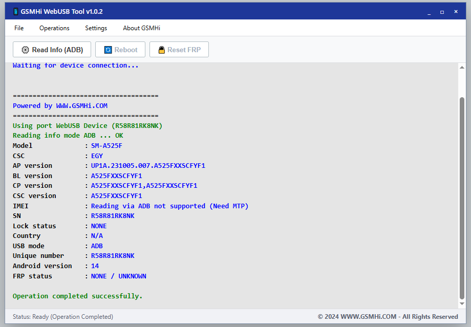

# 📱 GSMHi WebUSB Tool v1.0.2

A powerful, web-based Android ADB tool powered by the **WebUSB API**. This tool allows you to read Android device information directly from your browser without needing to install any heavy software or local ADB drivers.

## ✨ Features
- **No Installation Required:** Runs entirely in the web browser.
- **Read Device Info (ADB):** Fetches Model, CSC, AP/BL/CP versions, SN, Android Version, and more.
- **FRP Status Checker:** Detects if Factory Reset Protection is triggered.
- **Modern UI:** Clean, Windows-style user interface.

## 🛠️ Prerequisites
To use this tool, you need:
1. A Chromium-based browser (Google Chrome, Microsoft Edge, Brave, Opera).
2. **USB Debugging (ADB)** must be enabled on your Android device.
3. Original USB Cable.

## 🚀 How to Use
1. Open the tool in your browser.
2. Connect your Android device to the PC.
3. Click on **"Read Info (ADB)"**.
4. A browser popup will appear asking for USB permission. Select your device and click **Connect**.
5. Check your phone screen and check **"Always allow from this computer"** for ADB debugging.
6. The tool will display the device's information in the console window.

## ⚠️ Disclaimer
- This tool is developed for **educational purposes** and for professional GSM technicians.
- The developers are not responsible for any damage caused to devices by misuse.

## 👨‍💻 Developed By
- **[DIAA SABRY](https://diaa.us)** 

## 📄 License
This project is licensed under the MIT License.